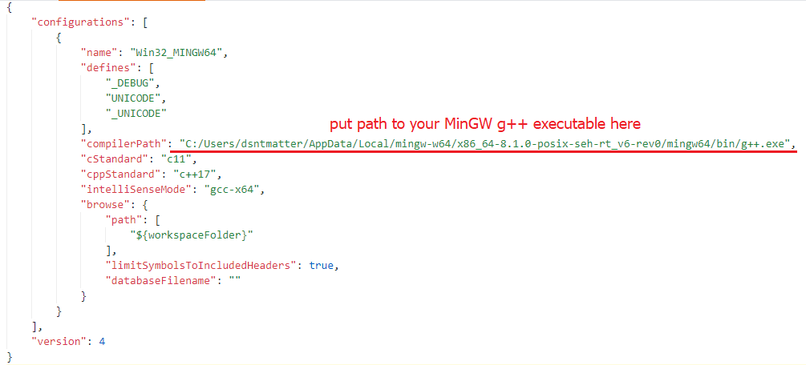
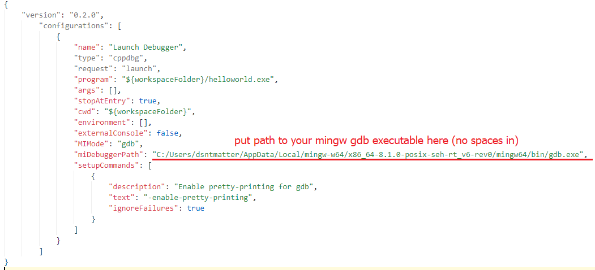

MinGW preset for Visual Studio Code project
===========================================
### Setup
Unfortunately, you need to specify some values before digging into programming:
1. Open _.vscode/c_cpp_properties.json_ and configure path to your MinGW g++ executable according to the picture:

2. Then open _.vscode/tasks.json_ to configure path to your MinGW gdb executable according to the picture:

3. Delete _images_ folder (it will no longer be needed)
4. Delete this README if you feel everything is OKay and installed correctly

### You're ready to go now!
1. Try out to build your program with ```Ctrl+Shift+B``` key combination
2. In case of success try out the debugger with ```F5```
3. If everything is okay - you (and me of course) are nice

## MISSING SECTION: how to add new files and other stuff
It's pretty simple and intuitive but anyway this section must be written
